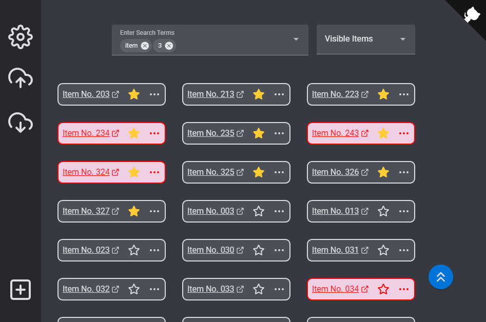
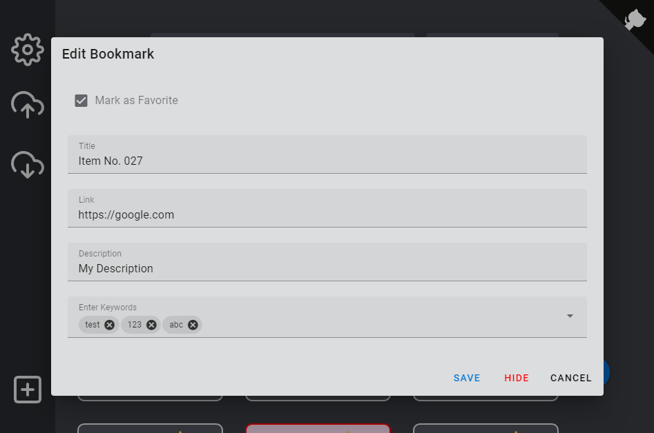

# Team-Bookmarks

* [How To Use](#how-to-use)
  * [Fork the Repository outside of Github](#fork-the-repository-outside-of-github)
* [Development Setup](#development-setup)
* [Libraries](#libraries)

Have look at the demo [here](https://h0rn0chse.github.io/team-bookmarks/). <br>This app enables the team to have a common set of bookmarks. This helps especially for onboardings and knowledge sharing. On top of the team-bookmark each user can personalize and add new bookmarks. Everything is stored in the `LocalStorage` and can easily be exported and imported.


<br />


## How to Use
Just fork this repository and adjust the [Team-Bookmarks](./public/team-bookmarks.json). You can then `build` and publish the `./docs/` folder (e.g. via GithubPages). You might install the `pre-commit hook`  via `npm run copy-pre-commit` to prevent missing builds.

__*Hint*__<br>
Although you only might change a static asset (e.g. `./public/team-bookmarks.json`) the `build` is required!

### Fork the Repository outside of Github
If your team works on a different git platform than Github you cannot fork the repo easily. But here is a description on how to make a fork available and how to update. [Fork outside of Github](./assets/Fork%20outside%20of%20Github.md)

## Development Setup

1. Installing dependencies
```
npm install
```
2. Install Pre-commit hook
```
npm run copy-pre-commit
```
3. Start dev setup (hot-reloads)
```
npm run dev
```
4. Build for production (automatically done by pre-commit hook)
```
npm run build
```

## Libraries
 * Github Corners [github.com/YunYouJun/wc-github-corners](https://github.com/YunYouJun/wc-github-corners)
 * Icons [github.com/feathericons/feather](https://github.com/feathericons/feather)
 * More Icons [github.com/Templarian/MaterialDesign](https://github.com/Templarian/MaterialDesign)
 * Vue [vuejs.org](https://vuejs.org/)
 * Pinia [pinia.vuejs.org](https://pinia.vuejs.org/)
 * Vuetify [next.vuetifyjs.com/en/](https://next.vuetifyjs.com/en/)
 * Vite [vitejs.dev/](https://vitejs.dev/)